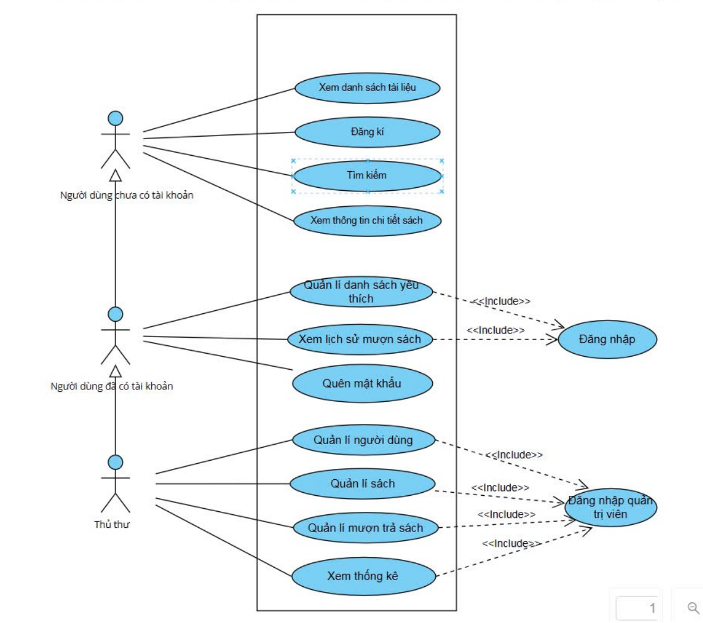
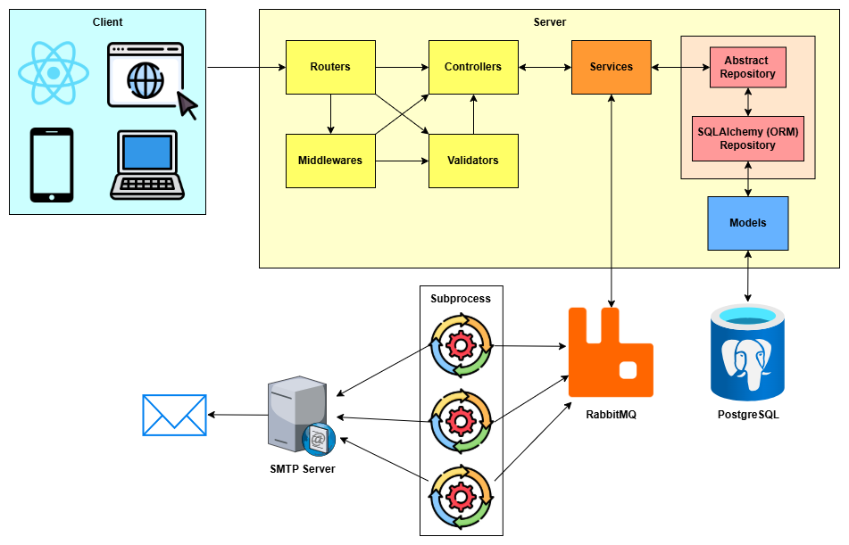

# 🏢 4M Library Manager 📚

## Description
4M Library Manager is a complete library management web application that supports librarians in managing books, users, and borrowing-returning activities. Additionally, for readers, the system allows viewing book information, searching, and managing favorite book lists.

## Features



### ✨ For Librarians:
- 🔒 Manage users.
- 📚 Manage books.
- 🔄 Manage borrowing-returning activities.
- 🖊️ View user and book statistics.
- 🔍 Search functionality in all management modules.

### ✨ For Readers:
- 👤 Register, login, and reset password (includes OTP verification via email).
- 🔍 View and search for book information.
- 🔢 Manage personal favorite book lists.
- 🔧 View personal borrowing history.

---

## System Architecture


## Technologies Used

### 🕹️ Frontend
- **ReactJS**: Build user interfaces.
- **React Router**: Manage navigation.
- **axios**: Connect client and server.
- **react-toastify**: Notifications.
- **PropTypes**: Validate data types.
- **react-chartjs-2**: Create charts.

### 🐛 Backend
- **Flask**: Python micro-framework.
- **SQLAlchemy**: Powerful ORM.
- **Flask-Migrate**: Manage database migrations.
- **PostgreSQL**: Relational database.
- **RabbitMQ**: Task queue for asynchronous operations.
- **Swagger**: Automatic API documentation.

---

## Installation

### System Requirements
- Python 3.8+
- Node.js 14+
- PostgreSQL
- RabbitMQ

### Installation Steps

#### Backend:
Create `.env` following `.env.example` and run commands below:
```bash
# Clone repository
$ git clone https://github.com/minhnguyenhai/LibraryManager.git
$ cd LibraryManager/server

# Create virtual environment
$ python -m venv venv
$ source venv/bin/activate  # Activate virtual environment (Linux/MacOS)

# Install dependencies
$ pip install -r requirements.txt

# Ensure start.sh has execute permission (Linux/MacOS)
$ chmod +x start.sh

# Start Flask server
$ ./start.sh
```
Backend APIs run at:
```
http://localhost:5000
```

#### Frontend:
```bash
# Navigate to frontend folder
$ cd ../fe

# Install dependencies
$ npm install

# Start ReactJS app
$ npm start
```

Access the application at:
```
http://localhost:3000
```

### Using Docker Compose
If using Docker compose, just only run the command below:
```bash
docker-compose up -d
```
the web application can be accessed at:
```
http://localhost
```